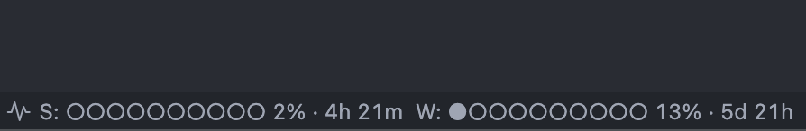
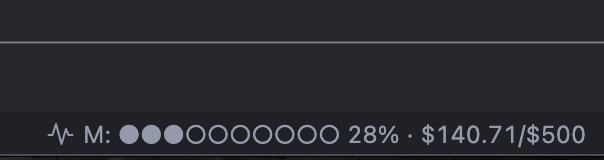
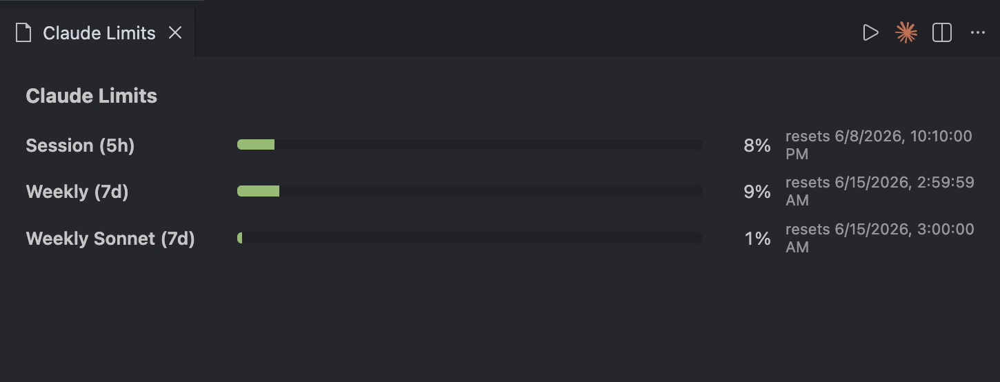
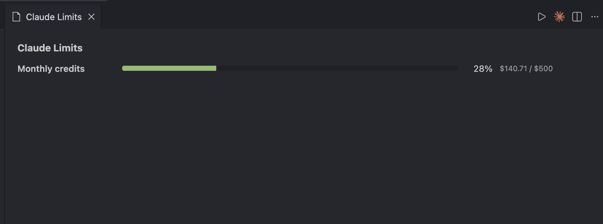

# Claude Limits Bar

A minimal VS Code extension that shows your Claude Code subscription rate-limit utilization in the status bar. macOS only.

## What it shows

- **5-hour rolling window** (`S:`) — session quota
- **Weekly** (`W:`) — overall 7-day quota across all models (falls back to the Sonnet-specific weekly bucket if the overall one is absent)
- **Monthly credits** (`M:`) — dollar-based pay-as-you-go usage, shown when enabled on your plan (e.g. `$140.71 / $500`)

The status-bar item turns **yellow at ≥70%** and **red at ≥90%** of the worst bucket currently shown. Clicking it opens the details panel and dismisses that color until the limit resets or usage climbs higher.

The details panel additionally breaks out the **Weekly Sonnet** bucket separately.

Data comes from `GET https://api.anthropic.com/api/oauth/usage` using the OAuth token Claude Code stores in your macOS Keychain (`Claude Code-credentials`). Token is read fresh each poll, never written to disk by this extension.

## Screenshots

Status bar:



Status bar with monthly (dollar) credits:



Details panel (click the status-bar item):



Details panel for a plan with monthly (dollar) credits:



## Install (from source)

```bash
git clone <this repo>
cd claude-limits-bar
npm install
npm run package    # produces claude-limits-bar-0.1.0.vsix
code --install-extension claude-limits-bar-0.1.0.vsix
```

Reload VS Code. The first fetch will trigger a Keychain prompt; click **Allow** (not "Always Allow" if you want visibility into future reads).

## Settings

| Key | Default | Description |
|---|---|---|
| `claudeLimitsBar.displayMode` | `both` | `session` / `weekly` / `both` |
| `claudeLimitsBar.pollMinutes` | `5` | Poll interval (min `1`) |
| `claudeLimitsBar.showProgressBar` | `true` | Show the dot bar in the status text |
| `claudeLimitsBar.alignment` | `right` | Status-bar side: `left` / `right` (applied immediately) |

## Commands

- **Claude Limits: Refresh Now** — force one fetch
- **Claude Limits: Show Details** — open the webview panel (also bound to status-bar click)
- **Claude Limits: Switch Display Mode** — cycle session → weekly → both

## Security notes

- Zero runtime dependencies (devDeps only: TypeScript and `@types/*`)
- All outbound traffic goes to `api.anthropic.com` (hardcoded hostname)
- `security` CLI is invoked via `execFileSync` — no shell, no command injection
- Token is sent in `Authorization: Bearer`, never logged or persisted
- Webview has CSP `default-src 'none'`; no scripts

## Known limitations

- macOS only (the Keychain access path uses `security`)
- Marketplace publication intentionally skipped — install from source
